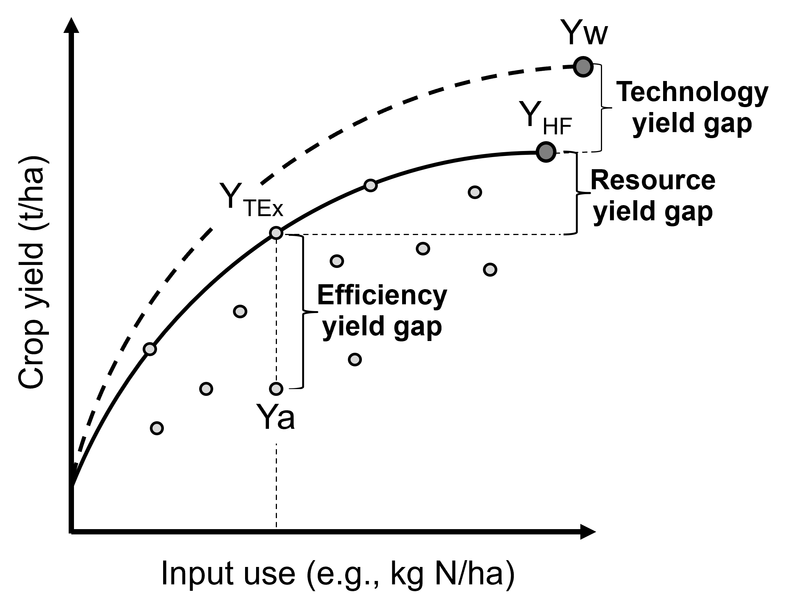
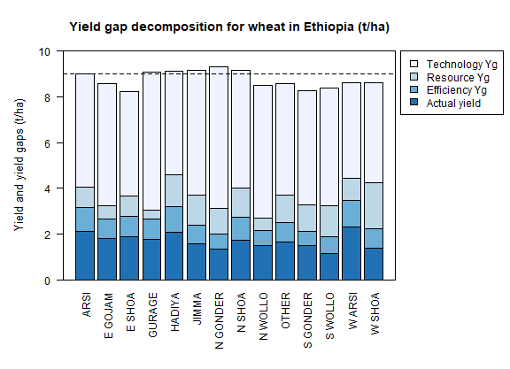
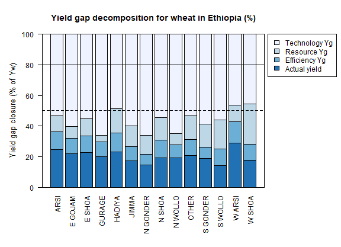

Workflow for Silva et al. (2017)
================================

**João Vasco Silva**, CIMMYT-Zimbabwe

--------------

**Introduction**
----------------

Yield gap decomposition has been increasingly applied in agronomy to
disentangle the impact of sub-optimal management on crop production and
to identify agronomic measures to improve yields. To date, most
applications refer to cereal crops (and some tuber and root crops) in a
wide range of production systems worldwide, particularly in sub-Saharan
Africa, South and Southeast Asia, and Northwest Europe. This notebook
aims to formalize the R scripts used to decompose yield gaps across most
of those applications making use of the framework introduced by
@Silva2017. Data collected by CIMMYT and EIAR for wheat in Ethiopia,
previously used for yield gap analysis [@Silva2021], are used here as an
example. Before diving into the R scripts it is important to understand
the key concepts and definitions involved in yield gap decomposition as
these determine how the different yield levels and associated yield gaps
are estimated.

The framework for yield gap decomposition described in this notebook
considers four different yield levels [@Silva2017]. First, the
**water-limited potential yield** (Yw) refers to the maximum yield that
can be obtained under rainfed conditions in a well-defined, and
relatively homogeneous, biophysical environment [@vanIttersum2013]. Yw
can be simulated with crop growth models or derived from field trials
with non-limiting levels of nutrients and pests, diseases, and weeds
fully controlled. Second, the **highest farmers’ yield** (Y\ :sub:`HF`)
refer to the maximum yields (e.g. average above the 90th percentile of
actual farmers’ yields) observed in a representative sample of farmers
sharing similar biophysical conditions (weather and soils) and
technologies adopted (e.g., varieties). Third, the **technical efficient
yield** (Y\ :sub:`TEx`) comprises the maximum yield that can be achieved
by farmers in a given production ecology for a given input level and can
be computed using methods of frontier analysis in combination with
concepts of production ecology [@Silva2017]. Finally, the **actual
yield** (Ya) refers to the yield in farmers’ fields as recorded in farm
surveys.

.. image:: ./framework.png :width: 400 :alt: Alternative text

   gaps, considered in the yield gap decomposition presented in this
   workflow. Source: Silva2017

   Visual illustration of the yield levels, and respective yield gaps,
   considered in the yield gap decomposition presented in this workflow.
   Source: Silva2017

The total yield gap and three intermediate yield gaps can be estimated
using the four yield levels previously described. The **total yield
gap** is calculated as the difference between Yw and Ya. The
**efficiency yield gap** is calculated as the difference between
Y\ :sub:`TEx` and Ya and it can be explained by crop management
imperfections related to time, form, and/or space of the inputs applied.
The **resource yield gap** is calculated as the difference between
Y\ :sub:`HF` and Y\ :sub:`TEx` and captures the yield penalty due to a
sub-optimal amount of inputs applied. Lastly, the **technology yield
gap** is calculated as the difference between Yw and Y\ :sub:`HF`, which
can be explained by resource yield gaps of specific inputs and/or
absence of certain technologies that would fully exploit the biophysical
potential of the system. Please note Ya and the intermediate yield gaps
can be expressed as a percentage of Yw, reflecting the current yield gap
closure and the share of yield gap explained by each intermediate yield
gap.

--------------

**Load required R packages**
----------------------------

First, we need to load the R packages needed to run this workflow.

.. code:: r

   # package names
   packages <- c("frontier", "dplyr", "tidyr", "knitr", "car", "RColorBrewer", "DT")
   # 
   # install packages
   installed_packages <- packages %in% rownames(installed.packages())
   if (any(installed_packages == FALSE)){
     install.packages(packages[!installed_packages])}
   ## Installing package into 'C:/Users/JSILVA/OneDrive - CIMMYT/Documents/R/win-library/4.0'
   ## (as 'lib' is unspecified)
   ## Error in contrib.url(repos, "source"): trying to use CRAN without setting a mirror
   # 
   # load packages
   invisible(lapply(packages, function(x) suppressMessages(require(x, character.only=T, quietly=T, warn.conflicts=F))))
   ## Warning: package 'lmtest' was built under R version 4.0.5
   ## Warning: package 'dplyr' was built under R version 4.0.5
   ## Warning: package 'knitr' was built under R version 4.0.5
   ## Warning: package 'car' was built under R version 4.0.5
   ## Warning: package 'carData' was built under R version 4.0.5
   ## Warning in library(package, lib.loc = lib.loc, character.only = TRUE,
   ## logical.return = TRUE, : there is no package called 'DT'

--------------

**Farmer field data**
---------------------

The first step is to load the farmer field data to be used for yield gap
analysis. The data contain (a) primary data on self-reported Ya,
management practices, and biophysical conditions at field level obtained
through a household survey, and (b) secondary data obtained from spatial
products using the GPS coordinates of the individual households. The
household survey is a panel of households over two growing seasons (2009
and 2013). Type and sources of secondary data include: climate zones
from the Global Yield Gap Atlas [@vanWart2013], soil water properties
from AfSIS-GYGA [@Leenaars2018], agro-ecological zones for Ethiopia
[@MoA1998], and farming systems classification for Africa
[@Tilahun2017].

.. code:: r

   # read .csv file with data
   file <- 'https://raw.githubusercontent.com/jvasco323/EiA_YGD_workflow/main/data-wheat-ethiopia.csv'
   data <- read.csv(url(file))
   # 
   # list variables of interest
   str(data)
   ## 'data.frame':    3783 obs. of  42 variables:
   ##  $ zone                 : chr  "WEST SHOA" "WEST SHOA" "WEST SHOA" "WEST SHOA" ...
   ##  $ zone_new             : chr  "W SHOA" "W SHOA" "W SHOA" "W SHOA" ...
   ##  $ farming_system       : chr  "6. Highland mixed farming system" "6. Highland mixed farming system" "6. Highland mixed farming system" "6. Highland mixed farming system" ...
   ##  $ aez                  : chr  "M2" "M2" "M2" "M2" ...
   ##  $ year                 : int  2009 2009 2009 2009 2009 2009 2009 2009 2009 2009 ...
   ##  $ season_year          : chr  "Meher_2009" "Meher_2009" "Meher_2009" "Meher_2009" ...
   ##  $ hhid                 : int  1 11 11 16 17 270 281 285 292 515 ...
   ##  $ plotid               : int  5 2 2 5 2 2 6 6 4 2 ...
   ##  $ subplotid            : int  1 4 3 1 3 1 1 1 1 1 ...
   ##  $ subplotsize_ha       : num  0.5 0.5 0.0625 1 1.5 0.5 0.25 0.25 1.5 0.5 ...
   ##  $ subplot_own          : chr  "Rented-in" "Owned" "Owned" "Rented-in" ...
   ##  $ subplot_manager      : chr  "Man" "Man" "Man" "Man" ...
   ##  $ plotdist_min         : num  10 5 2 15 10 5 15 30 5 5 ...
   ##  $ crop                 : chr  "Wheat_br" "Wheat_br" "Wheat_br" "Wheat_br" ...
   ##  $ gyga_cz              : int  5501 5501 5501 5501 5501 5501 5501 5501 5501 5501 ...
   ##  $ gyga_gdd             : num  6539 6539 6539 6539 6539 ...
   ##  $ gyga_tseas           : int  1208 1208 1208 1208 1208 1285 1200 1200 1200 1208 ...
   ##  $ seed_kgha            : num  206 250 192 64 33.3 ...
   ##  $ variety              : chr  "Landrace" "unknown" "unknown" "unknown" ...
   ##  $ gyga_ai              : num  6544 6544 6544 6544 6544 ...
   ##  $ gyga_av_water        : int  9 9 9 9 9 7 7 7 7 9 ...
   ##  $ soil_depth           : chr  "Deep" "Deep" "Medium" "Medium" ...
   ##  $ soil_slope           : chr  "Medium" "Steep" "Steep" "Flat" ...
   ##  $ waterlogging_yn      : chr  "No" "No" "No" "No" ...
   ##  $ drought_yn           : chr  "No" "No" "Yes" "No" ...
   ##  $ soilwatercons_yn     : chr  "Yes" "Yes" "Yes" "No" ...
   ##  $ oxplough_freq        : int  5 4 4 4 8 4 3 5 4 5 ...
   ##  $ oxplough_freq_cat    : chr  ">Five" "Four" "Four" "Four" ...
   ##  $ soil_fertility       : chr  "Poor" "Poor" "Poor" "Poor" ...
   ##  $ nfert_kgha           : num  32.3 41.3 51.7 32.3 21.5 ...
   ##  $ pfert_kgha           : num  10.04 20.07 16.06 10.04 6.69 ...
   ##  $ manure_yn            : chr  "No" "No" "No" "No" ...
   ##  $ residues_yn          : chr  "No" "Yes" "Yes" "Yes" ...
   ##  $ previous_crop        : chr  "Cereal" "Cereal" "Cereal" "Cereal" ...
   ##  $ herb_lha             : num  0.4 2 4 1 0.2 ...
   ##  $ handweeding_persdayha: num  24 8 64 20 16 0 16 28 0 22 ...
   ##  $ weeding_freq         : int  1 1 1 1 1 0 2 1 1 1 ...
   ##  $ weeding_freq_cat     : chr  "One" "One" "One" "One" ...
   ##  $ pesticide_yn         : chr  "No" "No" "No" "No" ...
   ##  $ disease_incidence_yn : chr  "No" "Yes" "No" "Yes" ...
   ##  $ pest_incidence_yn    : chr  "Yes" "No" "No" "No" ...
   ##  $ yield_tha            : num  1.2 2.4 3.2 1 0.267 ...

--------------

**Data manipulation**
---------------------

Some data transformations need to be done prior to the analysis. These
include (a) re-leveling and re-classification of categorical variables,
(b) log-transformation of continuous variables so that model
coefficients can be interpreted as elasticities, and (c) fill or drop
data not available. If needed, missing data for specific observations of
a given variable can be filled with the average value for that variable.
This is documented in the chunk of code below.

.. code:: r

   # create final data
   data <- subset(data, yield_tha > 0)
   data <- subset(data, residues_yn == "No" | residues_yn == "Yes")
   data <- subset(data, soil_slope == "Flat" | soil_slope == "Medium" | soil_slope == "Steep")
   data <- subset(data, zone_new != "")
   data <- subset(data, oxplough_freq_cat == "<Two" | 
                        oxplough_freq_cat == "Three" | 
                        oxplough_freq_cat == "Four" | 
                        oxplough_freq_cat == ">Five")
   data <- subset(data, weeding_freq_cat == "None" | 
                        weeding_freq_cat == "One" | 
                        weeding_freq_cat == "Two" | 
                        weeding_freq_cat == "Three+")
   # 
   # fill NA values
   data$seed_kgha[is.na(data$seed_kgha)] <- mean(data$seed_kgha, na.rm=T)
   data$nfert_kgha[is.na(data$nfert_kgha)] <- 0
   data$herb_lha[is.na(data$herb_lha)] <- 0
   data$handweeding_persdayha[is.na(data$handweeding_persdayha)] <- 0
   # 
   # reclassify categorical variables
   data$variety = ifelse(data$variety != 'Landrace' &  data$variety != 'unknown', 'Improved', data$variety)
   data$variety = ifelse(data$variety == 'Landrace', 'unknown', data$variety)
   data$nfert_yn = ifelse(data$nfert_kgha == 0, 'N0', 'N+')
   data$weeding_yn = ifelse(data$herb_lha == 0 & data$handweeding_persdayha == 0, 'No', 'Yes')
   # 
   # copy df with transformed data
   data_new <- data
   # 
   # replace 0 with small value for log-transformation
   data_new[data_new == 0] = 0.0001
   # 
   # log-transform continuous variables
   vars1 <- c('gyga_gdd', 'gyga_tseas', 'seed_kgha', 'gyga_ai', 'gyga_av_water', 'nfert_kgha', 'pfert_kgha',
              'herb_lha', 'handweeding_persdayha', 'yield_tha')
   log_f <- function(x){log(x)}
   data_new[,vars1] <- lapply(data_new[,vars1], log_f)
   # 
   # set categorical variables to factor
   vars2 <- c('farming_system', 'aez', 'zone_new', 'season_year', 'variety', 'soil_depth', 'soil_fertility',
              'waterlogging_yn', 'drought_yn', 'soilwatercons_yn', 'manure_yn', 'residues_yn', 'previous_crop',
              'oxplough_freq_cat', 'weeding_yn', 'pesticide_yn', 'disease_incidence_yn', 'pest_incidence_yn')
   data_new[,vars2] <- lapply(data_new[,vars2], factor)

--------------

**Descriptive statistics**
--------------------------

Descriptive statistics of the actual yield and (continuous) crop
management variables used in the analysis for the 2 years of the survey
are provided below. Actual yield of wheat across Ethiopia was on average
1.76 t/ha in 2009 and 1.77 t/ha in 2013. N and P application rates were
on average 48 kg N/ha and 20 kg P/ha, respectively. Plot sizes were on
average 0.45 ha in 2009 and 0.40 ha in 2013.

============================ ========= ========= ========== ==========
Variable                     Mean 2009 Mean 2013 StDev 2009 StDev 2013
============================ ========= ========= ========== ==========
Hand-weeding (person-day/ha) 21.84     24.28     30.46      35.46
Herbicide use (L/ha)         0.5       0.59      0.83       0.88
N application rate (kg N/ha) 48.07     48.99     40.53      32.04
P application rate (kg P/ha) 19.63     20.34     13.93      12.36
Seed rate (kg/ha)            192.88    195.43    79.85      95.66
Plot size (ha)               0.45      0.4       0.39       0.3
Actual wheat yield (t/ha)    1.76      1.77      1.13       1.09
============================ ========= ========= ========== ==========

--------------

**Efficiency yield gap**
------------------------

A stochastic frontier model is needed to estimate Y\ :sub:`TEx` and the
efficiency yield gap. Stochastic frontier analysis is an econometric
technique widely used for benchmarking different production units
[@Kumbhakar2000]. Stochastic frontiers differentiate two random errors:
technical inefficiency, *u\ i* (translated in agronomic terms as the
efficiency yield gap), and random noise, *v\ i*, hence separating the
effects of sub-optimal crop management (*u\ i*) from random noise
(*v\ i*) in the response variable. For yield gap analysis, the variables
used to estimate stochastic frontiers need to be selected based on
principles of production ecology [@vanIttersum1997] to capture the
impact of growth-defining, -limiting, and -reducing factors on crop
yield.

It is important to fit an **ordinary least squares (OLS) regression**
prior to fit a stochastic frontier. Although both models have the same
structure, and should exhibit similar signs and effect sizes for the
different variables, OLS regressions allow the computation of Variance
Inflation Factors (VIF) and hence to assess multi-colinearity between
variables. As a rule-of-thumb, VIF values above 10 indicate
multi-colinearity between variables, which is helpful to screen the
final set of variables to be included in the model (see:
https://en.wikipedia.org/wiki/Variance_inflation_factor). Please note
the VIF values and parameter estimates are not shown, but can be
obtained by removing the symbol # in the chunk of code below.

.. code:: r

   # fit ols regression model
   ols <- 
     lm(yield_tha ~ 
        season_year + gyga_gdd + gyga_tseas + seed_kgha + variety +
        gyga_ai + gyga_av_water + soil_depth + soil_fertility + waterlogging_yn + drought_yn + soilwatercons_yn + 
        nfert_kgha + manure_yn + residues_yn + previous_crop + oxplough_freq_cat +                                
        herb_lha + handweeding_persdayha + weeding_yn + pesticide_yn + disease_incidence_yn + pest_incidence_yn,  
        data=data_new)
   #
   # check vif values
   # vif(ols)
   #
   # see parameter estimates
   # summary(ols)

The OLS regression fitted above can now be fitted as a **stochastic
frontier model with a Cobb-Douglas functional form**. The Cobb-Douglas
functional form takes only the first-order terms and is thus the
simplest model that can be fit to the data. Two functions from the R
package *frontier* are used here: (1) the function *sfa()* is used to
estimate model parameters and, (2) the function *efficiencies()* is used
to estimate the technical efficiency scores (or the equivalent
efficiency yield gap in agronomy). Further information about the
theoretical background of these functions can be found in
@BatteseCoelli1992. This is illustrated in the chunk of code below,
which results are the same as those presented in Table 3 of @Silva2021
for the pooled data. The reader is thus referred to that manuscript for
further interpretation of model coefficients.

.. code:: r

   # fit cobb-douglas stochastic frontier
   sfa_cd <- 
     sfa(yield_tha ~ 
       season_year + gyga_gdd + gyga_tseas + seed_kgha + variety +
       gyga_ai + gyga_av_water + soil_depth + soil_fertility + waterlogging_yn + drought_yn + soilwatercons_yn +
       nfert_kgha + manure_yn + residues_yn + previous_crop + oxplough_freq_cat +
       herb_lha + handweeding_persdayha + weeding_yn + pesticide_yn + disease_incidence_yn + pest_incidence_yn,
       data=data_new)
   #
   # add technical efficiency score to data frame
   data_new$te_score_cd = efficiencies(sfa_cd, asInData=T)
   #
   # see parameter estimates
   summary(sfa_cd)
   ## Error Components Frontier (see Battese & Coelli 1992)
   ## Inefficiency decreases the endogenous variable (as in a production function)
   ## The dependent variable is logged
   ## Iterative ML estimation terminated after 33 iterations:
   ## log likelihood values and parameters of two successive iterations
   ## are within the tolerance limit
   ## 
   ## final maximum likelihood estimates
   ##                           Estimate Std. Error  z value  Pr(>|z|)    
   ## (Intercept)              9.7733888  1.1050740   8.8441 < 2.2e-16 ***
   ## season_yearMeher_2013   -0.0539923  0.0264810  -2.0389  0.041460 *  
   ## gyga_gdd                -0.5840446  0.0909876  -6.4189 1.372e-10 ***
   ## gyga_tseas              -0.3252022  0.0525343  -6.1903 6.006e-10 ***
   ## seed_kgha                0.0976523  0.0123652   7.8974 2.849e-15 ***
   ## varietyunknown          -0.0018340  0.0231824  -0.0791  0.936944    
   ## gyga_ai                 -0.3311850  0.0594151  -5.5741 2.488e-08 ***
   ## gyga_av_water           -0.0080901  0.0412886  -0.1959  0.844658    
   ## soil_depthMedium        -0.0742006  0.0232508  -3.1913  0.001416 ** 
   ## soil_depthShallow       -0.0812014  0.0291497  -2.7857  0.005342 ** 
   ## soil_fertilityMedium    -0.0568591  0.0203025  -2.8006  0.005101 ** 
   ## soil_fertilityPoor      -0.1627704  0.0309154  -5.2650 1.402e-07 ***
   ## waterlogging_ynYes      -0.3472614  0.0379737  -9.1448 < 2.2e-16 ***
   ## drought_ynYes           -0.4474776  0.0456593  -9.8004 < 2.2e-16 ***
   ## soilwatercons_ynYes      0.0585665  0.0275969   2.1222  0.033820 *  
   ## nfert_kgha               0.2723653  0.0126521  21.5272 < 2.2e-16 ***
   ## manure_ynYes             0.0373056  0.0261372   1.4273  0.153494    
   ## residues_ynYes           0.0316401  0.0270959   1.1677  0.242925    
   ## previous_cropLegume      0.0220438  0.0244585   0.9013  0.367442    
   ## previous_cropOther       0.1230667  0.0264684   4.6496 3.326e-06 ***
   ## oxplough_freq_cat>Five   0.0534308  0.0580652   0.9202  0.357475    
   ## oxplough_freq_catFour   -0.0126670  0.0569799  -0.2223  0.824075    
   ## oxplough_freq_catThree  -0.1015532  0.0573738  -1.7700  0.076722 .  
   ## herb_lha                 0.0134322  0.0029268   4.5894 4.446e-06 ***
   ## handweeding_persdayha   -0.0038850  0.0020551  -1.8905  0.058697 .  
   ## weeding_ynYes            0.0369644  0.0496531   0.7445  0.456602    
   ## pesticide_ynYes          0.1208168  0.0495391   2.4388  0.014735 *  
   ## disease_incidence_ynYes -0.3161391  0.0314308 -10.0582 < 2.2e-16 ***
   ## pest_incidence_ynYes    -0.0857481  0.0733460  -1.1691  0.242367    
   ## sigmaSq                  0.5977253  0.0250709  23.8414 < 2.2e-16 ***
   ## gamma                    0.7421739  0.0246107  30.1565 < 2.2e-16 ***
   ## ---
   ## Signif. codes:  0 '***' 0.001 '**' 0.01 '*' 0.05 '.' 0.1 ' ' 1
   ## log likelihood value: -3066.353 
   ## 
   ## cross-sectional data
   ## total number of observations = 3694 
   ## 
   ## mean efficiency: 0.633058

The simple Cobb-Douglas model fitted above can be made more complex by
adding second-order terms in what is known as a **stochastic frontier
model with a translog functional form**. This functional form is most
flexible as it considers non-linear relations between variables (squared
terms and interactions). Yet, the translog functional form should only
be fitted last to assess non-linear effects on crop yield as the large
number of parameters make it difficult to interpret. The functions
*sfa()* and *efficiencies()* are used again to estimate model parameters
and technical efficiency scores, respectively. Please note this output
is not displayed given the large number of parameters involved. To do
so, kindly remove the symbol # in the chunk of code below.

.. code:: r

   # fit translog stochastic frontier
   sfa_tl <- 
     sfa(yield_tha ~ 
           
      # 1st order terms (linear)
      season_year + gyga_gdd + gyga_tseas + seed_kgha + variety +
      gyga_ai + gyga_av_water + soil_depth + soil_fertility + waterlogging_yn + drought_yn + soilwatercons_yn +
      nfert_kgha + manure_yn + residues_yn + previous_crop + oxplough_freq_cat +
      herb_lha + handweeding_persdayha + weeding_yn + pesticide_yn + disease_incidence_yn + pest_incidence_yn +
         
      # 2nd order terms (squared)
      I(0.5*gyga_gdd^2) + I(0.5*gyga_tseas^2) + I(0.5*seed_kgha^2) +
      I(0.5*gyga_ai^2) + I(0.5*gyga_av_water^2) +
      I(0.5*nfert_kgha^2) +
      I(0.5*herb_lha^2) + I(0.5*handweeding_persdayha^2) +
         
      # 2nd order terms (interactions) 
      I(gyga_gdd*gyga_tseas) + I(gyga_gdd*seed_kgha) + I(gyga_gdd*gyga_ai) + I(gyga_gdd*gyga_av_water) +
        I(gyga_gdd*nfert_kgha) + I(gyga_gdd*herb_lha) + I(gyga_gdd*handweeding_persdayha) +
      I(gyga_tseas*seed_kgha) + I(gyga_tseas*gyga_ai) + I(gyga_tseas*gyga_av_water) + I(gyga_tseas*nfert_kgha) +
        I(gyga_tseas*herb_lha) + I(gyga_tseas*handweeding_persdayha) +
      I(seed_kgha*gyga_ai) + I(seed_kgha*gyga_av_water) + I(seed_kgha*nfert_kgha) + I(seed_kgha*herb_lha) +
        I(seed_kgha*handweeding_persdayha) +
      I(gyga_ai*gyga_av_water) + I(gyga_ai*nfert_kgha) + I(gyga_ai*herb_lha) + I(gyga_ai*handweeding_persdayha) +
      I(gyga_av_water*nfert_kgha) + I(gyga_av_water*herb_lha) + I(gyga_av_water*handweeding_persdayha) +
      I(nfert_kgha*herb_lha) + I(nfert_kgha*handweeding_persdayha) +
      I(herb_lha*handweeding_persdayha),
      data=data_new)
   #
   # add technical efficiency score to data frame
   data_new$te_score_tl = efficiencies(sfa_tl, asInData=T)
   #
   # see parameter estimates
   # summary(sfa_tl)

The two chunks of code above added two new columns to the original data
frame, namely **te_score_cd** and **te_score_tl**. These technical
efficiency scores range between 0 and 1 and indicate how extra yield
could have been produced for the observed level of inputs. For instance,
if the technical efficiency score is equal to 0.2 for a specific field,
then that field only produced 20% of what it could have produced with
the level of inputs it received. The efficiency yield gap is the
agronomic equivalent of technical inefficiency when variables used in
the stochastic frontier analysis are selected based on concepts of
production ecology. Thus, Y\ :sub:`TEx` and the efficiency yield gap can
be estimated from the technical efficiency scores as follows.

.. code:: r

   # estimate efficiency yield gap (%)
   data_new['efficiency_yg'] = 100 - (data_new['te_score_cd'] * 100)
   #
   # select relevant columns
   data_new <- data_new[c('zone_new', 'season_year', 'hhid', 'plotid', 'subplotid', 'te_score_cd', 'te_score_tl', 
                          'efficiency_yg')]
   #
   # merge the new columns to original data frame
   data <- merge(data, data_new, by=c('zone_new', 'season_year', 'hhid', 'subplotid'), all.x=T)
   #
   # estimate technical efficiency yield (t/ha)
   data['ytex_tha'] = data['yield_tha'] / data['te_score_cd']

--------------

**Resource yield gap**
----------------------

Before calculating Y\ :sub:`HF`, it is useful to categorize the
farm-fields into highest-, average-, and lowest-yielding based on the
distribution of the actual yield. Highest-yielding fields were
identified as the observations above the 90th percentile of Ya and the
highest farmers’ yields (**Y\ HF**) were computed as the mean Ya for
these fields. Similarly, the lowest-yielding fields were identified as
the observations below the 10^th percentile of Ya (**Y\ LF**), and the
average-yielding fields as the observations between the 10th and the
90^th percentile of Ya (**Y\ AF**).

The field classification described above needs to be done for a **given
biophysical unit**, composed in this case of a unique year x climate
zone x soil fertility combination, to avoid confounding between
environmental conditions and crop management. For wheat in Ethiopia,
‘year’ refers to the Meher seasons of 2009 and 2013, ‘climate zone’
refers to the units included in the climate delineation scheme of GYGA,
and ‘soil fertility’ refers to farmers’ own assessment of the fertility
of their soil. Variety type was not considered in the the field
classification because there was no significant yield difference between
variety types (see results of the Cobb-Douglas stochastic frontier model
above), but it should be considered otherwise.

.. code:: r

   # create an empty data frame
   data_final <- data.frame()
   #
   # create loop per year
   for(yr in unique(data$year)){
     subset_year <- subset(data, year == yr)
     #
     # create loop per climate zone
     for(cz in unique(subset_year$gyga_cz)){
       subset_cz <- subset(subset_year, gyga_cz == cz)
       #
       # create loop per soil type
       for(soil in unique(subset_cz$soil_fertility)){
         subset_soil <- subset(subset_cz, soil_fertility == soil)
         
         # create column with field class based on yield distribution
         subset_soil$field_class <- ifelse(subset_soil$yield_tha >= quantile(subset_soil$yield_tha, 0.90), 
                                              'YHF', '')
         subset_soil$field_class <- ifelse(subset_soil$yield_tha <= quantile(subset_soil$yield_tha, 0.10), 
                                              'YLF', subset_soil$field_class)
         subset_soil$field_class <- ifelse(subset_soil$yield_tha > quantile(subset_soil$yield_tha, 0.10) & 
                                              subset_soil$yield_tha < quantile(subset_soil$yield_tha, 0.90), 
                                              'YAF', subset_soil$field_class)
         #
         # subset highest yielding fields only
         yhf <- subset(subset_soil, field_class == 'YHF')
         #
         # add column with yhf in t/ha to data frame
         subset_soil['yhf_tha'] <- mean(yhf$yield_tha, na.rm=T)
         #
         # bind all individual fields into single data frame
         data_final <- rbind(data_final, subset_soil)
   }}}

The chunk of code above implements the classification of fields as
highest-, average-, and lowest-yielding fields and the estimation of
Y\ :sub:`HF` for each field in the data set. The variables used for this
classification (i.e., year, climate zone, and soil fertility class) were
the most suitable for this specific example, meaning it is possible to
use other types of variables to control for differences in biophysical
conditions across fields (e.g., landscape position or slope), which will
depend on the data set and cropping systems at stake.

--------------

**Technology yield gap**
------------------------

The water-limited yield (Yw) is the yield benchmark for rainfed crops
[@vanIttersum2013], which is the case of wheat in Ethiopia.
Spatial-explicit data on Yw can be obtained from different sources and a
**tier-approach** is proposed for that. The most preferred data source
on yield ceilings is GYGA from which data can be sourced through
http://www.yieldgap.org (an API to GYGA can also be created on a demand
basis). If the required data are not available in GYGA, yield ceilings
can be simulated with crop models or obtained through literature review
(least preferred option). Simulated yields in GYGA refer to most
recently released high-yield crop cultivars, grown in pure stands. Yet,
yield ceilings should be simulated for different varieties when data are
available and different varieties are known to have different yield
potential - see @Silva2022 for an example of how to consider yield gaps
due to variety choice in the yield gap decomposition framework used
here.

The chunk of code below combines the water-limited yield data retrieved
from GYGA based on the GPS coordinates of the surveyed households to the
main database containing all field level data. The steps needed to
retrieve these data from the GYGA API are shown in a **companion
notebook**. Note: the water-limited yields presented here are slightly
different than those presented in @Silva2021 due to different criteria
used to retrieve these data in the companion script.

.. code:: r

   # load dataframe with yw data
   file <- 'https://raw.githubusercontent.com/jvasco323/EiA_YGD_workflow/main/data-gps-coordinates-final.csv'
   yw_data <- read.csv(url(file))
   yw_data <- yw_data[c('hhid', 'GYGA_CZ', 'Yw_average', 'Yw_2009', 'Yw_2013')]
   yw_data <- unique(yw_data)
   #
   # merge yw data with the rest of the data
   data_final <- merge(data_final, yw_data, by='hhid', all.x=T)
   #
   # get yw per field
   data_final$yw_tha <- ifelse(data_final$year == 2009, data_final$Yw_2009, data_final$Yw_2013)
   #
   # summarize of yw data
   summary_yw <- unique(data_final[c('GYGA_CZ', 'Yw_average', 'Yw_2009', 'Yw_2013')])
   summary_yw <- aggregate(summary_yw[c(2:4)], by=list('GYGA_CZ'=summary_yw$GYGA_CZ), FUN=mean)
   summary_yw[c(2:4)] <- round(summary_yw[c(2:3)], 1)
   colnames(summary_yw)[1] <- 'Climate zone'
   colnames(summary_yw)[2] <- 'Yw long-term (t/ha)'
   colnames(summary_yw)[3] <- 'Yw 2009 (t/ha)'
   colnames(summary_yw)[4] <- 'Yw 2013 (t/ha)'
   DT::datatable(summary_yw,
                 options=list(pageLength=5, 
                              lengthMenu=c(5, 10, 15)))
   ## Error in loadNamespace(name): there is no package called 'DT'

--------------

**Yield gap decomposition**
---------------------------

The four yield levels needed for yield gap decomposition were calculated
in the previous section. At last, the intermediate yield gaps need to be
estimated in t/ha and in terms of yield gap closure, i.e., relative to
Yw. This what the chunk of code below implements. With all this
information in hand, a summary figure showing the **yield gap
decomposition** for units of interest can be produced. This is
exemplified here for different administrative regions and for different
farming systems.

Below is the code for estimating the **yield gaps in t/ha**. Please note
automation is needed for data sets spanning over many years, but the
general principle is the same.

.. code:: r

   # total yield gap in t/ha
   data_final['yg_total_2009'] <- data_final['Yw_2009'] - data_final['yield_tha']
   data_final['yg_total_2013'] <- data_final['Yw_2013'] - data_final['yield_tha']
   data_final['yg_total'] <- ifelse(data_final$year == 2009, data_final$yg_total_2009, 
                                                             data_final$yg_total_2013)
   #
   # efficiency yield gap in t/ha
   data_final['eff_yg_tha_2009'] <- data_final['ytex_tha'] - data_final['yield_tha']
   data_final['eff_yg_tha_2013'] <- data_final['ytex_tha'] - data_final['yield_tha']
   data_final['eff_yg_tha'] <- ifelse(data_final$year == 2009, data_final$eff_yg_tha_2009, 
                                                               data_final$eff_yg_tha_2013)
   #
   # resource yield gap in t/ha
   data_final['res_yg_tha_2009'] <- data_final['yhf_tha'] - data_final['ytex_tha']
   data_final['res_yg_tha_2013'] <- data_final['yhf_tha'] - data_final['ytex_tha']
   data_final['res_yg_tha'] <- ifelse(data_final$year == 2009, data_final$res_yg_tha_2009, 
                                                               data_final$res_yg_tha_2013)
   #
   # technology yield gap in t/ha
   data_final['tech_yg_tha_2009'] <- data_final['Yw_2009'] - data_final['yhf_tha']
   data_final['tech_yg_tha_2013'] <- data_final['Yw_2013'] - data_final['yhf_tha']
   data_final['tech_yg_tha'] <- ifelse(data_final$year == 2009, data_final$tech_yg_tha_2009, 
                                                                data_final$tech_yg_tha_2013)
   #
   # aggregate absolute yield gaps by zone
   absolute <- aggregate(data_final[c('yield_tha', 'eff_yg_tha', 'res_yg_tha', 'tech_yg_tha')], by=list('zone_new'=data_final$zone_new), FUN=mean, na.rm=T)
   absolute_t <- t(absolute)
   colnames(absolute_t) <- absolute$zone_new
   absolute_t <- absolute_t[-1, ]
   #
   # make barplot
   pal <- rev(palette(brewer.pal(n=4, name="Blues")))
   pal <- rev(palette(brewer.pal(n=4, name="Blues")))
   par(mfrow=c(1,1), mar=c(7,5,4,9), yaxs='i')
   {barplot(absolute_t, 
            las=2, 
            cex.lab=1.1,
            ylim=c(0, 10),
            ylab='Yield and yield gaps (t/ha)',
            main='Yield gap decomposition for wheat in Ethiopia (t/ha)',
            col=pal) 
    abline(h=9, col="black", lty=2)
    legend("topright", 
           inset=c(-0.325, 0),
           legend=c("Technology Yg", "Resource Yg", "Efficiency Yg", "Actual yield"), 
           fill=c(palette(brewer.pal(n=4, name="Blues"))), 
           xpd=TRUE)
    box()}

|image1|

Below is the code for estimating the **yield gap closure relative to
Yw**. Please note automation is needed for data sets spanning over many
years, but the general principle is the same.

.. code:: r

   # yield gap closure relative to yw
   data_final['yg_closure_2009'] <- (data_final['yield_tha'] / data_final['Yw_2009']) * 100
   data_final['yg_closure_2013'] <- (data_final['yield_tha'] / data_final['Yw_2013']) * 100
   data_final['yg_closure'] <- ifelse(data_final$year == 2009, data_final$yg_closure_2009, 
                                                               data_final$yg_closure_2013)
   #
   # ytex relative to yw
   data_final['eff_yg_2009'] <- (data_final['ytex_tha'] / data_final['Yw_2009']) * 100
   data_final['eff_yg_2013'] <- (data_final['ytex_tha'] / data_final['Yw_2013']) * 100
   data_final['ytex_closure'] <- ifelse(data_final$year == 2009, data_final$eff_yg_2009, 
                                                                 data_final$eff_yg_2013)
   #
   # yhf relative to yw
   data_final['res_yg_2009'] <- (data_final['yhf_tha'] / data_final['Yw_2009']) * 100
   data_final['res_yg_2013'] <- (data_final['yhf_tha'] / data_final['Yw_2013']) * 100
   data_final['yhf_closure'] <- ifelse(data_final$year == 2009, data_final$res_yg_2009, 
                                                                data_final$res_yg_2013)
   #
   # intermediate yield gaps
   data_final$eff_yg <- data_final$ytex_closure - data_final$yg_closure
   data_final$res_yg <- data_final$yhf_closure - data_final$ytex_closure
   data_final$tech_yg <- 100 - data_final$yhf_closure
   #
   # aggregate absolute yield gaps by zone
   relative <- aggregate(data_final[c('yg_closure', 'eff_yg', 'res_yg', 'tech_yg')], by=list('zone_new'=data_final$zone_new), FUN=mean, na.rm=T)
   relative_t <- t(relative)
   colnames(relative_t) <- relative$zone_new
   relative_t <- relative_t[-1, ]
   #
   # make barplot
   par(mfrow=c(1,1), mar=c(7,5,4,9), yaxs='i')
   {barplot(relative_t, 
            las=2, 
            cex.lab=1.1,
            ylim=c(0, 100),
            ylab='Yield gap closure (% of Yw)',
            main='Yield gap decomposition for wheat in Ethiopia (%)',
            col=pal) 
    abline(h=50, col="black", lty=2)
    abline(h=80, col="black", lty=1)
    legend("topright", 
           inset=c(-0.325, 0),
           legend=c("Technology Yg", "Resource Yg", "Efficiency Yg", "Actual yield"), 
           fill=c(palette(brewer.pal(n=4, name="Blues"))),
           xpd=T)
    box()}

|image2|

--------------

**Recommendations**
-------------------

The work flow described in this notebook was applied to a wide range of
(cereal) cropping systems worldwide. The relative importance of the
three intermediate yield gaps, as well as inter-linkages between them,
depend on the degree of yield gap closure (i.e., level of
intensification) of the cropping system/dataset in question. The
experiences learned so far with the application of this framework across
contrasting cropping systems can be summarized as follows:

-  **Low yielding cereal crops in Ethiopia and Zambia:** Large
   importance of the technology yield gap, which is often confounded
   with the resource yield gap, because inputs used in highest yielding
   fields is way below the inputs needed to reach the water-limited
   yield. Possible confounds between the technology and efficiency yield
   gaps is also possible when resource-use efficiency observed on-farm
   is way below what is agronomically possible (due to e.g., poor crop
   establishment or poor management of pests, diseases, and weeds). For
   further examples and information see @Assefa2020, @Silva2021, and
   @Silva2022a.

-  **Intermediate yielding cereal crops in the Philippines:** Similar
   relative importance of efficiency, resource, and technology yield
   gaps. This means that yield gaps in such cropping systems are
   explained by a multitude of factors: sub-optimal time, space, form,
   and rate of input use and technologies used on-farm not being able to
   reach the potential or water-limited yield. Such patterns have also
   been observed for other rice cropping systems in Southeast Asia
   (e.g., Thailand). For further examples and information see @Silva2017
   and @Silva2022.

-  **High yielding cereal crops in the Netherlands and NW India:** Small
   resource yield gap and the also small total yield gap is equally
   explained by efficiency and technology yield gaps. It is questionable
   to focus only on explaining yield gaps in such cropping systems, as
   often there is scope to reduce input use without compromising yield.
   It is thus important to complement such analysis with studies on
   resource-use efficiency, and to consider pests, diseases, and weeds
   as these are often responsible for the small yield gaps observed. For
   further examples and information see @Silva2017a, @Silva2021, and
   @Nayak2022.

The framework has **limitations** that users must be aware of. Firstly,
the framework takes a production perspective and does not consider
profitability or links to policy explicitly. Examples on how to do so
can be found in @vanDijk2017 and @vanDijk2020. Secondly, yield ceilings
only consider a limited set of climatic, edaphic, and management
factors, which might overestimate the yields (and hence the technology
yield gap) that can potentially be obtained in practice. For instance,
soil acidity can be a serious constraint to crop yields in some areas
and such effects are not captured in the yield ceilings simulated
[@Silva2022a]. It is thus recommended to compare the simulated yield
ceilings against experimental trial data under optimal conditions.
Thirdly, conclusions derived from the interpretation of resource yield
gaps must be contextualized with knowledge about the farming system. For
instance, promoting greater amounts of inputs might be detrimental to
farmers in dryland areas with erratic rainfall [@Silva2022a] whereas in
other regions promoting increased fertilizer use might lead to increased
disease pressure [@Silva2022]. Lastly, it is difficult to derive
concrete recommendations to narrow efficiency yield gaps as the
associated crop management to do so is highly context specific. Further
research is on-going to improve some of these aspects.

--------------

**Acknowledgments**
-------------------

I thank Martin van Ittersum (WUR-PPS), Andy McDonald (Cornell CALS) and
Johan Ninanya (CIP-Peru) for constructive comments in an earlier version
of this workflow and Marloes van Loon (WUR-PPS) for retrieving the yield
ceiling data from the Global Yield Gap Atlas. The development of this
notebook was possible thanks to the financial support from the OneCGIAR
initiative on *Excellence in Agronomy*. For further support and
questions on how to implement this workflow to other data sets, or
further thoughts on how to improve the theoretical framework used, are
almost welcome and should be addressed to **j.silva@cgiar.org**.

--------------

**References**
--------------

